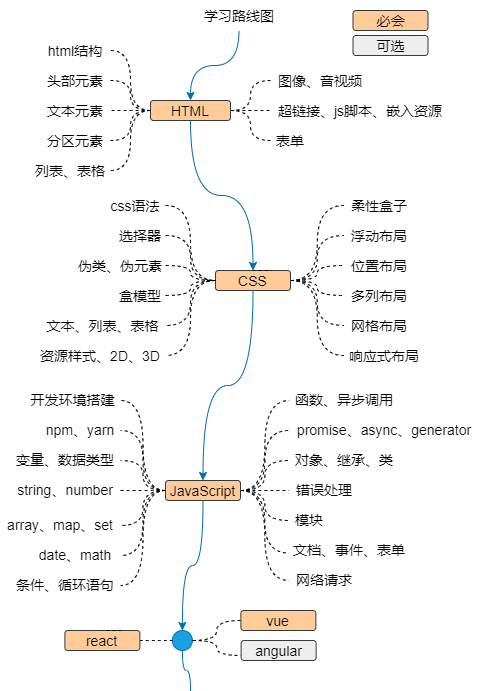

# 前端学习笔记
---

## 前端学习路线

本书的学习路线图如下:

本书参考的学习资源: [MDN](https://developer.mozilla.org/)、[w3school](https://www.w3school.com.cn/index.html)、[现代JavaScript教程](https://zh.javascript.info/)、[react](https://reactjs.org/)

如果你想成为一名资深web开发者，学习路线可参考：[developer-roadmap](https://github.com/kamranahmedse/developer-roadmap.git)

本书作为个人学习笔记，所有内容都是按个人学习习惯整理，其中可能有不当之处，本人将在今后的学习中逐渐更正。