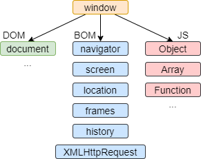
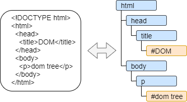

# 文档DOM
---

## 浏览器环境

JavaScript最初就是为web浏览器控制网页创建的，其在浏览器中运行的示意图：



window是根对象，其代表JS代码的全局对象，也提供浏览器窗口控制方法。

DOM (Document Object Model) 是文档对象模型，其将页面所有内容表示为可修改的对象。

BOM (Browser Object Modul) 是浏览器对象模型，其提供处理文档(document)外所有其它对象。

## DOM树

文档对象模型(DOM)中，每个HTML标签和标签内的文本都是一个对象。DOM树就是将HTML标签表示为树形结构（如下图所示）。



## 获取DOM节点

通过DOM可以操作所有元素，而对DOM的所有操作都是以document对象开始的。

```javascript
// 顶层节点, DOM的导航属性(navigation property) 
let a = document.documentElement  // 相当于<html>
let b = document.head  // 相当于<head>
let c = document.body  // 相当于<body>

// 通过顶层节点获取其它元素节点: parentNode, childNodes, firstChild, lastChild, previousSibling, nextSibling
// 通过元素节点获取其它节点: parentElement, children, firstElementChild, lastElementChild, previousElementSibling, nextElementSibling

// 通过搜索获取节点
let elem = document.getElementById('name');  // 通过id查询, 示例: id='name'
let elem = document.querySelector('.name');  // 通过css选择器查询, 返回匹配的第一个节点, 示例: class="name"
let elems = document.querySelectorAll(css);  // 返回匹配集合
let elem = document.closest(css);  // 返回最近的祖先元素
let ok = document.matches(css);  // 是否有匹配的元素, 返回bool

// 文档中表单, 其是一个特殊集合
let a = document.forms[0];  // 获取文档中的第一个表单
let form = document.forms.login;  // 获取<form name="login">元素
let elem = form.elements.one;  // 获取<input name="one">元素
// 简写: let elem = document.froms.login.one;
console.log(one.form);  // 结果: HTMLFormElement, 反向引用
```

## 节点属性

不同DOM节点对应不同的类，因此不同DOM节点拥有不同的属性。

DOM的类有EventTarget, Node, Element, HTMLElement, HTMLInputElement, ..., 类的继承关系：EventTarget > Node > 其它DOM类，可用 instanceof 来检测各节点属于哪个类。

DOM节点属性和方法：

```javascript
let txt = '<p>xx</p>'
let elem = document.getElementById('msg');

// DOM节点内容
elem.innerHTML = txt;   // 将elem节点内的内容用txt替换
elem.outerHTML = txt;   // 将elem整个节点用txt替换
elem.textContent = 'xx';  // 将elem内的文本内容用'xx'替换

elem.hidden = true;  // 将elem节点隐藏
console.log(elem.tagName, elem.nodeName);  // 获取标签名, 节点名
console.log(elem.nodeType);  // 获取节点类型, 1为元素节点, 2为文本节点

// 其它属性: type, value, id, ..., 对应着html标签的属性

// 样式属性, 通过style属性设置html标签属性, 如：
elem.style.width = '100px';
elem.style.display = "none";  // 等价于: elem.hidden = true

let style = getComputedStyle(elem, [pseudo]);  // 获取节点style

// html标签类属性
elem.className = 'xx';  // 设置标签class属性, 对整个class的值进行修改
elem.classList.add/remove('xx'); // 添加/移除类, 对class值以空格分割, 分开处理
elem.classList.toggle('xx');  // 如果类不存在就添加类，存在就移除它
elem.classList.contains('xx');  // 检查给定类，返回 true/false

// DOM节点方法
elem.hasAttribute(name);  // 检查html标签中是否存在name属性
elem.getAttribute(name);  // 获取html标签中的name属性值
elem.setAttribute(name, value);  // 设置html标签中的属性值
elem.removeAttribute(name);  // 移除html标签中的name属性
```

DOM节点的属性和方法详情信息可参考：[Web API](https://developer.mozilla.org/en-US/docs/Web/API)

对于尺寸相关信息的获取可参照：[元素大小](https://javascript.info/size-and-scroll)、[元素坐标](https://javascript.info/coordinates)、[浏览器窗口大小](https://javascript.info/size-and-scroll-window)

## 修改文档

文档修改指新增节点、删除节点等操作。

```javascript
// 创建元素
let new = document.createElement('div');  // 创建元素节点
let txt = document.createTextNode('xx');  // 创建文本节点

// 插入节点方法
elem.append(new);  // 在elem内末尾插入
elem.prepend(new);  // 在elem内开头插入
elem.before(new);  // 在elem前面插入
elem.after(new);  // 在elem后面插入
elem.replaceWith(new);  // 将elem替换为给定的节点或字符串

elem.insertAdjacentHTML(where, html);  // 插入html文本, 常用
elem.insertAdjacentText(where, text);  // 插入文本
insertAdjacentElement(where, new);  // 插入另一个节点
// where值: beforeend 末尾, afterbegin 开头, beforebegin 前面, afterend 后面

// 删除节点
elem.remove();

// 节点克隆
 elem.cloneNode(true|false);  // 克隆节点, 深克隆 | 浅克隆
```

