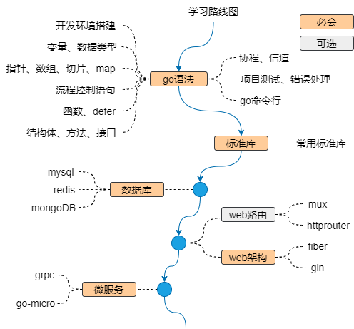

# go语言学习笔记
---

## go学习路线

本书的学习路线图如下：

本书参考的学习资源: [go语言中文文档](https://www.topgoer.com/), [go 101](https://go101.org/article/101.html)

如果你想成为一名资深gopher，学习路线可参照：[golang-developer-roadmap](https://github.com/Alikhll/golang-developer-roadmap.git)

本书作为个人学习笔记，所有内容都是按个人学习习惯整理，其中可能有不当之处，本人将在今后的学习中逐渐更正。
