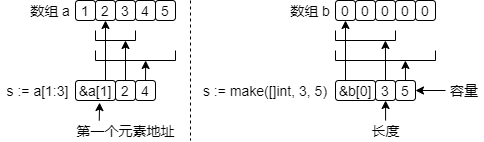

# 数组切片
---

## 数组array

数组是一种数据类型固定长度的序列，其声明格式如下：

```go
var arr1 [3]int  // 声明一个长度为3的int数组
fmt.Println(len(arr1), arr1)  // 结果: 3, [0 0 0]; 不对数组赋值时, 会用默认值填充数组

arr1[0] = 1  // 通过索引调用数组元素, 索引范围: 0 ~ len(arr1)-1, 调用不能超出索引范围
   
var arr2 [3]string = [3]string{"a", "b"}  // 声明数组, 并赋值
var arr3 = [2]int{1, 2}  // 赋值时指定类型
var arr4 = [...]int{3, 4}  // 不指定长度, 默认长度为2
var arr5 = [4]string{2: "d", 1: "e"}  // 通过索引赋予初始值

arr6 := [2]int{}  // 类型推导式声明
arr7 := [...]string{3: "x", 5: "y"}  // 该数组长度为6

a := [2][2]int{{0, 0}, {1, 1}}  // 多维数组
b := [...][3]int{{0, 1, 2}, {}}  // 第二纬度不能用[...]
```

## 切片slice

切片是对数组片段的引用，其的底层其实是数组。切片的三个概念：切片元素 、切片长度、切片容量。切片长度小于等于切片容量。

### 创建切片

切片的创建有两种方式：从数组创建和用make创建

```go
// 从数组创建切片
var arr [5]int = [5]int{1, 2, 3, 4, 5}
var a []int = arr[1:3]  // 从数组arr索引1到3的切片(结果不包含索引3)
fmt.Println(a, len(a), cap(a))  // 结果: [2 3] 2 4

var b = arr[:]  // 引用整个数组
c := arr[3:]  // 从索引3到结尾的切片
d := arr[:2]  // 从索引0到2的切片
f := arr[1:3:4]  // 从索引1到3的切片, 切片长度: 3-1, 切片容量为: 4-1
g := b[3:4]  // 从切片中创建切片

// 用make()函数创建切片
var a []int  // 定义一个切片, 该切片还无法使用
a = make([]int, 3, 5)  // 为切片s1分配一个长度为3, 容量为5的空间
fmt.Println(a, len(a), cap(a))  // 运行结果: [0 0 0] 3 5

var b []string = make([]string, 2, 4)  // 声明切片, 并分配空间
var c = make([]string, 2)  // 可以不指定容量, 必须指定切片长度

e := []string{"a", "b"}  // 声明切片并赋值
f := []string{2: "a", 1: "b"}  // 通过索引赋予初始值
g := []int{}  // 声明空切片 

// func cap(v Type) int 内置函数，用于获取切片容量。
// func make(t Type, size ...IntegerType) Type 内置函数，为引用数据类型分配空间。
```

### 切片操作

切片操作，如：增加元素，切片复制等。

```go
// 修改元素
var arr = []int{1, 2, 3}
a, b = arr[:2], arr[1:3:3]  // 结果: [1 2],  [2 3]
 
a[1] = 4  // 通过索引调用切片元素, 索引范围: 0 ~ len(a)-1, 不能超出索引范围
fmt.Println(a, arr)  // 切片的修改会影响到底层数组, 结果: [1 4] [1 4 3], 
fmt.Println(b)  // 切片的修改会影响到其它引用同一数组的切片, 结果: [4 3]    

// 增加元素
c := make([]int, 2, 4)
c = append(c, 1)  // 追加元素
fmt.Println(c, len(c), cap(c))  // 结果: [0 0 1] 3 4

c = append(c, 2, 3)  // 追加多个元素. 当切片长度大于容量时, 底层会创建一个新数组.
fmt.Println(c, len(c), cap(c))  // 结果: [0 0 1 2 3] 5 8

// 删除元素
d := []string{"a", "b", "c", "d", "e"}
d = d[:len(d) - 1]  // 删除尾部元素
fmt.Println(d, len(d), cap(d))  // 结果: [a b c d] 4 5

d = d[1:]  // 删除头部元素
fmt.Println(d, len(d), cap(d))  // 结果: [b c d] 3 4

d = append(d[:1], d[2:]...)  // 删除中间元素
fmt.Println(d, len(d), cap(d))  // 结果: [b d] 2 4

//  Spread语法: d... , 作用是将切片解析成参数, 详情见函数章节

// 复制元素
x := []int{1, 2}
y := make([]int, 2)

l := copy(y, x)  // 将x复制给y, l表示复制长度
fmt.Println(y, len(y), cap(y), l)  // 结果: [1 2] 2 2 2

y[1] = 3
fmt.Println(y, x)  // 运行结果: [1 3] [1 2], 修改复制切片值不会影响原切片值

z := make([]int, 4)
l = copy(z, x)  // z长度大于x
fmt.Println(z, len(z), cap(z), l)  // 结果: [1 2 0 0] 4 4 2

k := make([]int, 2)
l = copy(k, z)  // k长度小于z
fmt.Println(k, len(k), cap(k), l)  // 结果: [1 2] 2 2 2

l = copy(z, k[1:])  // 覆盖式复制
fmt.Println(z, len(z), cap(z), l)  // 结果: [2 2 0 0] 4 4 1

// func append(slice []Type, elems ...Type) []Type 内置函数，用于追加切片元素。
// func copy(dst, src []Type) int 内置函数，用于复制切片。
```

### 修改字符串

在2.2中我们知道字符串中的字符无法直接更改，但可以将字符串转换为切片后更改，如：

```go
a := "goto"
b := []byte(a)  // 将字符串转换为字符切片
fmt.Println(b)  // 结果: [103 111 116 111]

b[2] = 'T'
a = string(b)  // 将字符切片转换为字符串
fmt.Println(a)  // 运行结果: goTo

c := "我的妈呀!"  // 汉字需要3个byte存储
d := []rune(c)  // 转换为切片
d[2] = '*'
c = string(d)
fmt.Println(c)  // 结果: // 我的*呀!
```

## 数组vs切片

数组的长度是固定的，切片长度是可以动态改变的。切片和数组关系如下图：



从图中可以看出，切片并不存储真实数据，其底层结构分三部分：第一个元素地址、切片长度、切片容量。当数组比较大时，切片比数组占用空间更小，因此对于大数组的操作或引用推荐使用切片。

可以通过以下方式将切片转换为数组：

```go
a := []int{1, 2, 3}
var b []string

c := (*[2]int)(a)  // b是一个数组指针, 注意数组长度不能大于切片长度, 即len(b) <= len(a)
fmt.Println(c, len(c))  // 运行结果: &[1 2] 2

d := (*[0]int)(a)  // 非空切片转换为长度0的数组
e := (*[0]string)(b)  // 空切片转换为长度为0的数组
fmt.Println(d, e)  // 运行结果: &[] <nil>
```