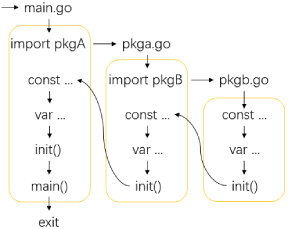

# 函数
---

## 函数基础

函数作为程序的重要组成部分，go中函数的声明和调用格式如下：

```go
// 函数声明及调用
func Add(a, b int, c string) (int, string) {  // 关键词 函数名(传入形参) (返回值) {}
    x := a + b    
    y := b + ".gif"
    return x, y  // 函数返回, 表示函数结束退出, 并返回结果
}
fmt.Printf("%T", Add)  // 结果: func(int, int, string) (int, string), 函数类型

_, x := Add(1, 2, "test")  // 调用函数: 函数名(传入实参), "_" 忽略返回值
y := Add(1, 2, 'xx')  // 忽略第二个返回值

// 函数类型
func(a int, b string) (x int, z bool)  // 指定返回值变量名及类型, x, z在函数体中不用再次声明
func(a string, b, c int) (x, y int, z bool)  // 简写, 对于命名的返回值: return 等价于 return x, y, z
func(a, b int) (int, bool)  // 只指定返回值类型
func(a string)  // 无返回值
func() (x string)  // 无传入参数
func()  // 无传入参数, 无返回值

// 函数参数, 函数的传入参数或返回值可以是任意类型，如：指针、切片、map、函数等
func swapA(x, y int)  // 值类型传入形参, x, y会复制一份传入实参值

func swapB(x, y *int)   // 指针类型传入形参, x , y会复制传入实参指针
swapB(&a, b)  // a是值类型变量, b是引用类型变量

func Show(key string, val ...int)  // val是长参数(Rest), val底层会创建一个切片
Show("ming", arr...)  // 等价于: Show("ming", arr[0], arr[1], ...) 

// Spread语法: arr... , 作用是将切片解析成参数. 
```

## 匿名函数

go中函数可以像普通变量一样使用。

```go
// 匿名函数
x := func(a, b int) (int) {  // 关键词(形参) (返回值类型) 
   return a + b 
}(1, 2)  // 将函数运行结果赋值给变量

swap := func(a, b *int) {  // 将函数本身赋值给变量
   *a, *b = *b, *a 
}
a, b := 1, 2
swap(&a, &b)  // 调用匿名函数
  
fmt.Printf("%v, %T", swap, swap)  // 变量swap是一个指向函数的指针, 结果: 0x47f800, func(*int, *int)

// 函数类型别名
type MyFunc func(string) int  // 关键词 类型名 函数类型
func countLen(s string, f MyFunc) {  // 接受函数参数
    fmt.Println(f(s))
}
f := func(s string) int {
   return len(s)
}
countLen("wang", f)  // 传入匿名函数, 结果: 4
```

## 延迟调用

延迟调用是指在函数执行完return后再执行的语句。

```go
func Show() {
    defer fmt.Println("one")  // defer内容被推入栈中, 先写的后执行
    defer fmt.Println("two")
    fmt.Println("third")
}
Show()  // 结果: third two one 
```

## init函数

init函数是初始化函数，用于包(package)的初始化。一个包可以拥有多个init函数。init函数可用于任意包中。

```go
func init() {  // 无传入参数, 无返回值
    fmt.Println("init function")
}
```

go程序初始化顺序：



## 闭包

闭包是一个函数和相关的引用环境组合的一个整体。

```go
func add(b int) func(int) int {  //定义一个闭包
    return func(i int) int {
        b += i
        return b
    }  // 返回的函数中变量b为引用环境, 其值动态保存
}
tmp := add(1)  // 调用闭包
fmt.Println(tmp(1), tmp(1))  //运行结果: 2 3
```

## 递归

递归指在运行中函数调用自身的过程。

```go
func factorial(n int) int {
    if n <= 1 {  // 递归结束条件
        return 1
    }
    return n * factorial(n - 1)  // 递归调用
}
a := factorial(4)   
```

## 内置函数

go中有部分内置函数可以直接使用

```go
// 变量初始化
func make(t Type, size ...IntegerType) Type  // 初始化引用类型变量
func new(Type) *Type  // 为值类型分配空间

// 变量属性
func len(v Type) int  // 获取变量长度
func cap(v Type) int  // 获取变量长度

// 切片操作
func append(slice []Type, elems ...Type) []Type  // 追加切片元素
func copy(dst, src []Type) int  // 复制切片

// 删除map中的键值对
func delete(m map[Type]Type, key Type)

// 关闭信道
func close(c chan<- Type)

// 错误
func panic(v interface{})  // 抛出错误
func recover() interface{}  // 捕获错误

// 复数
func complex(r, i FloatType) ComplexType  // 创建复数
func real(c ComplexType) FloatType  // 获取复数实部
func imag(c ComplexType) FloatType  // 获取复数虚部

// 打印数据
func Print(args ...Type)
func Println(args ...Type)
```

