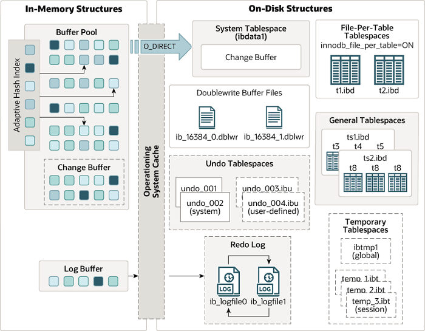

# 存储引擎
---

## InnoDB

Innodb是一种高可靠和高性能的存储引擎。其优点:

* 严格遵循ACID模型: 原子性, 一致性, 隔离性, 持久性。
* 多版本并发控制（MVCC）

InnoDB存储引擎架构:



```sql
# innodb引擎配置
innodb_buffer_pool_size 为innodb缓冲区池大小, 建议设置为系统内存的50％到75％, 默认128M
innodb_buffer_pool_chunk_size 缓冲池块大小, 默认128M, 
innodb_buffer_pool_instances 缓冲池数, 提高并发能力, 适用于有数GB内存的系统
# 缓冲池数 * 缓冲池块 = 缓冲池大小

innodb_flush_method 数据文件及redo log的打开和刷写模式
  # fdatasync模式: buffer pool, log buffer <-> os buffer <-> disk 
  # O_DSYNC模式: buffer pool <-> os buffer <-> disk; log buffer <-> disk
  # O_DIRECT模式: buffer pool <-> disk; log buffer <-> os buffer <-> disk

innodb_log_buffer_size 日志缓冲区大小, 默认16M
innodb_flush_log_at_trx_commit 为redo log刷新到磁盘策略, 0每秒刷一次; 1每次事务都刷; 2每次事务都写入, 但每秒刷一次.
innodb_flush_log_at_timeout 日志刷新到磁盘频率
innodb_log_file_size 为redo log大小

innodb_lock_wait_timeout 锁等待时长, 用户释放死锁
innodb_print_all_deadlocks 打印死锁信息

innodb_thread_concurrency 并发线程数, 默认是0
innodb_thread_sleep_delay 线程超标时, 新线程休眠时间

# 引擎查询
> show engine innodb status\G;   /* 引擎状态, 可查看内存分配情况 */
> show table status from db_name like 'tb_name'\G;  /* 查看表属性 */
> select @@GLOBAL.transaction_isolation, @@transaction_isolation;  /* 查看事务隔离级别 */
> show variable like 'read_only';  /* 数据库自读设置 */

> alter table tb_name engine=innodb;  /* 表碎片化整理 */
```

innoDB索引：聚簇索引 (primary key) 和二级索引。

### InnoDB事务模型

innoDB锁机制：
* 共享锁S：允许多个事务同时读取行，排他锁X：只允许一个事务进行更新和删除行。
* 意向锁：指示事务稍后对表中的行采用的锁，有意向共享锁IS或意向排他锁IX。
* 记录锁：对索引记录的锁定。
* 间隙锁：对索引记录之间的间隙的锁定，或对第一个或最后一个索引记录之前的间隙的锁定。

死锁是指多个事务都持有对方需要的锁而无法进行事务的情况。

事务隔离级别：
* repeatable read：默认隔离级别，同一事务中读取的结果由第一次读取时创建的快照确定。
* read committed：读已提交，同一事务中每次读取都会创建新快照，即同一事务读取结果可能不同。
* read uncommitted：读未提交，最小限度隔离级别，容易产生幻读。
* serializable：序列化，所有事务安顺序执行。
